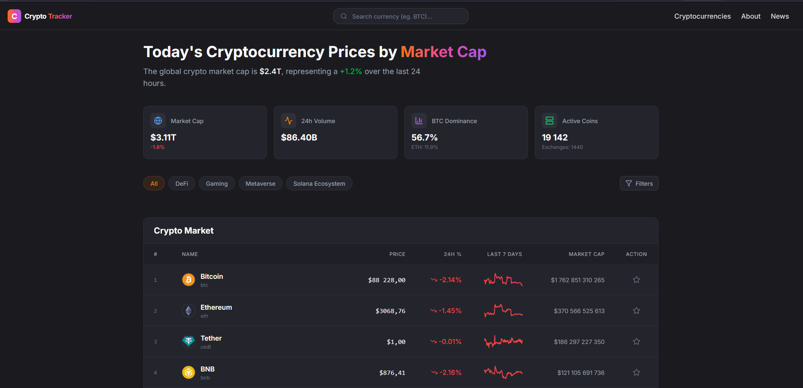
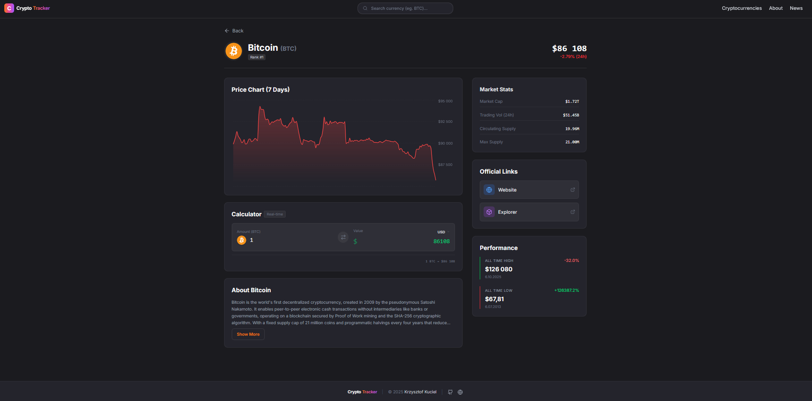
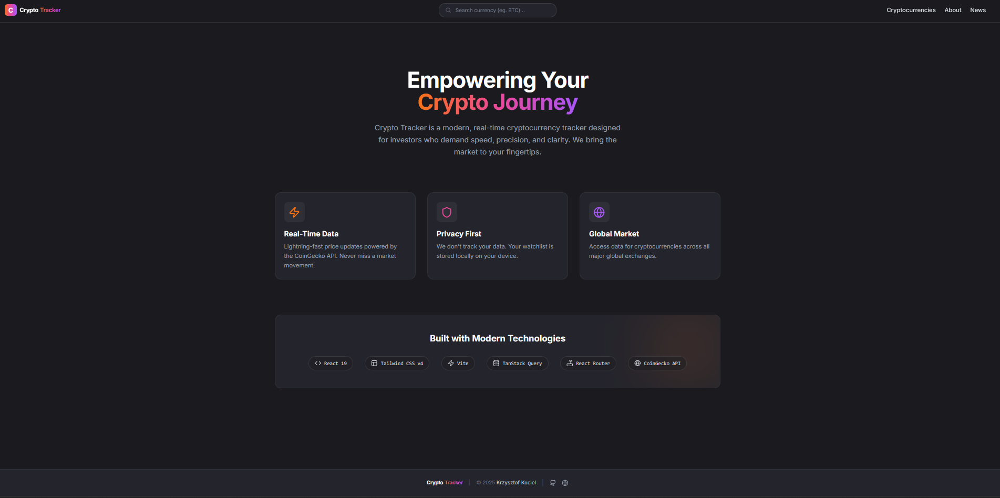
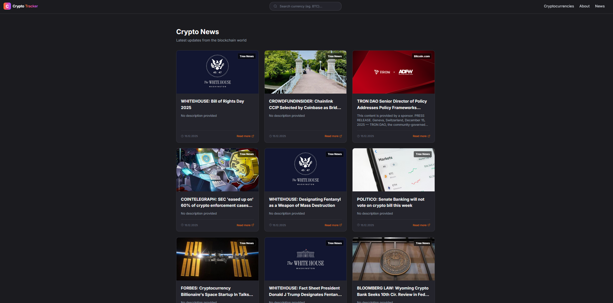

# 🚀 Crypto Market Tracker

A modern, real-time cryptocurrency tracking application built with **React 19** and **Vite**. This project provides real-time market data, interactive charts, and deep insights into the crypto world using the CoinGecko API.

[](https://vercel-crypto-tracker-app.vercel.app/)


> [!IMPORTANT]
> **API LIMITATIONS:** This project uses the free tier of the **CoinGecko API**.
> There is a strict limit on requests per minute (approx. 10-30 req/min).
> If data stops loading or you see errors, please wait a moment before refreshing.

## Table of Contents

- [Key Features](#key-features)
  - [Real-Time Market Data](#real-time-market-data)
  - [Advanced Search](#advanced-search)
  - [Detailed Coin Analytics](#detailed-coin-analytics)
  - [UI & UX](#ui--ux)
- [Tech Stack](#tech-stack)
- [Getting Started](#getting-started)
- [Screenshots](#screenshots)
- [Todo / Roadmap](#todo)

---

## Key Features

### Real-Time Market Data

- **Live Crypto Table:** Displays top cryptocurrencies with prices, 24h change, and market cap.
- **Sparklines:** Visual representation of 7-day price trends directly in the table (using `Recharts`).
- **Global Metrics:** Tracks total market cap, volume, and BTC/ETH dominance with smart caching.
- **Pagination:** Server-side pagination for browsing thousands of coins efficiently.
- **Crypto News:** Auto-updating news feed with fallback data mechanism.

### Advanced Search

- **Global Search Bar:** Debounced search with "smart suggestion" dropdown.
- **Debouncing:** Implemented custom `useDebounce` hook (500ms) to minimize API calls.
- **Smart Dropdown:** Shows suggested coins with symbols and ranks. Handles loading, error, and empty states gracefully.

### Detailed Coin Analytics

- **Dynamic Routing:** Individual pages for every coin (e.g., `/coin/bitcoin`).
- **Interactive Charts:** Area charts visualizing price action over the last 7 days.
- **Market Stats:** Key metrics like Circulating Supply, Max Supply, and ATH.
- **Smart Descriptions:** Parses and displays HTML descriptions safely with "Show More/Less" functionality.
- **Smart Converter:** Real-time crypto-to-fiat conversion (USD, EUR, PLN, GBP, etc.) with bilateral calculation.

### UI & UX

- **Watchlist System:** Persisted locally favorites list that syncs instantly across the app.
- **Modern Design:** Built with **Tailwind CSS v4**. Dark mode aesthetic with glassmorphism effects (`backdrop-blur`).
- **Responsive:** Fully mobile-responsive layout with a custom hamburger menu.
- **Feedback:** Loading skeletons, spinners, and user-friendly error messages (handling API 429 limits).

---

## Tech Stack

- **Core:** [React 19](https://react.dev/), [Vite](https://vitejs.dev/)
- **Styling:** [Tailwind CSS v4](https://tailwindcss.com/), [Lucide React](https://lucide.dev/) (Icons)
- **State Management:** [TanStack Query v5](https://tanstack.com/query/latest) (Server State), [React Context API](https://react.dev/learn/passing-data-deeply-with-context) (Global State)
- **API** [Axios](https://axios-http.com/)
- **Routing:** [React Router DOM](https://reactrouter.com/)
- **Charts:** [Recharts](https://recharts.org/)

---

## Getting Started

Follow these steps to run the project locally:

### 1. Clone the repository:

```bash
git clone https://github.com/KucielKrzysztof/Crypto-tracker-app.git
```

### 2. Install dependencies:

```bash
npm install
```

### 3. Run the development server:

```bash
npm run dev
```

### 4. Open your browser: Visit http://localhost:5173

---

## Screenshots

### Homepage


### Cryptocurrencies Page



### Crypto Details Page



### About Page



### News Page



---

## Todo

- [x] News Page (Completed)
- [ ] User Authentication (Future)

### Data:

Data provided by [CoinGecko API](https://www.coingecko.com/en/api).
